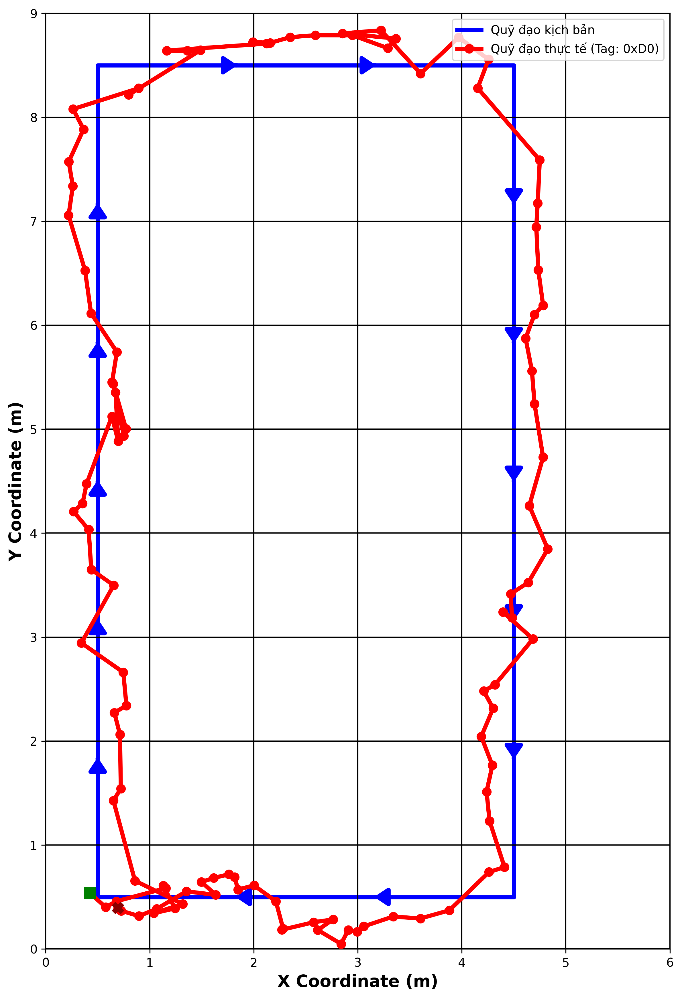
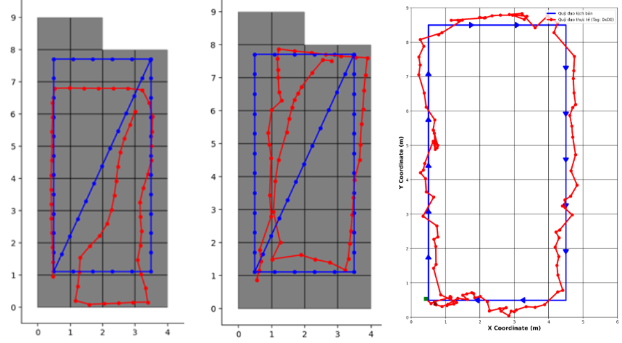

# Indoor Positioning System (IPS) for Firefighting Training Simulation

An advanced, real-time Indoor Positioning System utilizing Ultra-Wideband (UWB) technology to digitize and simulate firefighting training environments. 

## Project Overview

Firefighting training with real fire poses significant safety risks, incurs high material costs, and lacks the flexibility to dynamically change scenarios. Transitioning to a simulated or Virtual Reality (VR) training environment is an inevitable trend. However, to create a highly interactive simulation, the system must solve a critical challenge: **Tracking the trainee's exact location and actions indoors in real-time.** 

Since traditional Global Positioning Systems (GPS) fail in indoor environments due to signal attenuation and concrete blockage, this project focuses on developing a **Indoor Positioning System (IPS)**. By leveraging **Ultra-Wideband (UWB)** technology — which uses nanosecond radio pulses to measure the Time of Flight (ToF)—this system achieves centimeter-level positioning accuracy. The system completely digitizes a physical fire hose, tracking the user's coordinates, nozzle direction, and valve operations to interact with virtual fires seamlessly.

## Key Features

- **High-Precision UWB Positioning:** Utilizes Single-Sided Two-Way Ranging (SS-TWR) combined with a Time Division Multiple Access (TDMA) network to prevent radio collisions and ensure stable multi-tag tracking.
- **Hardware-Level Clock Drift Compensation:** Implements advanced algorithms directly reading the DW1000's Carrier Integrator register to compensate for crystal oscillator deviations, maximizing ToF accuracy.
- **Smart Fire Hose Prototype:** A real firefighting nozzle retrofitted with 9-DoF IMU sensors, valve actuators, and an LCD screen to provide an immersive First-Person View (FPV) training experience.
- **Advanced Tracking Algorithms:** Integrates a **1D Kalman Filter** for noise reduction and the **Levenberg-Marquardt (LM)** non-linear optimization algorithm to solve the 2D Trilateration problem with minimal latency.
- **Web-based Management Dashboard:** A centralized control system via MQTT and WebSockets, allowing instructors to draw indoor maps, spawn virtual fires, and monitor the trainees' trajectories in real-time.

## Technology Stack & Hardware

The system is built upon a modular, dual-MCU architecture to separate high-speed radio communications from graphical processing and sensor data acquisition.

| Component | Hardware / Device | Description |
| :--- | :--- | :--- |
| **UWB RF Module** | Decawave DW1000 (BU01) | Provides ultra-wideband radio communication. Calculates highly precise TX/RX timestamps for Time-of-Flight (ToF) distance measurements. |
| **Co-Processor (Ranging)** | STM32F103C8T6 (ARM Cortex-M3) | MCU to handle SPI communication with DW1000, managing the microsecond timing required for the TDMA superframe and control core WSN logic |
| **Main MCU (Tag & Master)** | ESP32-WROOM-32 | Acts as the central MCU. Reads sensor data, renders TFT graphics, and acts as the IoT Gateway bridging the UWB network to the Server via Wi-Fi/MQTT. |
| **IMU Sensor** | Bosch BNO055 (9-DoF) | Features a built-in Sensor Fusion algorithm outputting absolute Quaternions and Euler angles to track the nozzle's orientation (yaw/pitch/roll). |
| **HMI Display** | 2.8" TFT LCD (ILI9341) | Displays the virtual map, user position, and interacting virtual fires directly on the training equipment. |
| **Actuators** | Analog Potentiometers | Digitizes the physical water valve opening (0-100%) and spray mode (straight stream vs. fog spray). |
| **Server & Software** | Python, MySQL, MQTT, Bootstrap | Backend handles the Levenberg-Marquardt LLS optimization and human/fire interaction logic. Frontend provides trainers with comprehensive tools for device management, virtual map configuration, training scenario setup, and a real-time operational dashboard for firefighting training execution. |

## Prototype Design

The hardware devices is entirely custom-built to ensure high mobility, stable power management, and a realistic training experience. It consists of two main physical components: the interactive training equipment and the spatial referencing network of Beacons. This design approach enables trainees to acquire practical experience and execute fundamental firefighting maneuvers using authentic equipment, thereby ensuring highly realistic training while strictly maintaining a hazard-free environment.

  

*Hardware Showcase 1: The trainning prototype modified directly from a real firefighting nozzle. It has the custom dual-MCU PCB, a 9-DoF IMU for orientation tracking, mechanical potentiometers to digitize valve operations, and a 2.8" TFT screen serving as the trainee's FPV interface.*

  

*Hardware Showcase 2: The UWB Beacon network setup. Custom-designed UWB anchor nodes (Master and Slaves) powered by 18650 Li-ion batteries for completely wireless deployment. The nodes are mounted on portable stands, allowing for rapid and flexible setup across various indoor training environments.*

## Experimental Results & Evaluation

The core objective of this project is to provide highly accurate indoor tracking. The system was tested in a 50m² experimental room. The following graphs demonstrate the positioning accuracy of the UWB system.

### UWB Tracking Performance

  

*Figure 1: Trajectory tracking results. The **blue line** represents the ground-truth predefined path, while the **red line** indicates the real-time estimated coordinates calculated by the UWB system.*

Visual evaluation demonstrates that the experimental trajectory closely adheres to the ground-truth path across both straight segments and turning points. The UWB system operates stably, tracking the user's movements with minimal latency.

### Comparison with Traditional IPS Approaches (Wi-Fi RSSI + CNN + PDR)

To benchmark our UWB system, we compared the experimental results with another parallel IPS research conducted by our team. The reference method utilized Wi-Fi Received Signal Strength Indicator (RSSI) Fingerprinting combined with geomagnetic data, processed through a **Convolutional Neural Network (CNN)** and refined by a Kalman-based **Pedestrian Dead Reckoning (PDR)** algorithm. *(Note: The results of this reference system have been officially  presented at the 2025 Asia Meeting on Environment and Electrical Engineering (EEE-AM25) international conference, and published on IEEE Xplore. DOI: [10.1109/EEE-AM66675.2025.11473930](https://doi.org/10.1109/EEE-AM66675.2025.11473930)).*

*Figure 2: Trajectory comparison among different IPS methods. From left to right: Traditional PDR, CNN-enhanced PDR, and our proposed UWB method.*

**Table: Mean Error Comparison among IPS Methods**

| Positioning Method | Mean Error (m) |
| :--- | :--- |
| PDR (IMU only) | 0.826 m |
| PDR + CNN (Wi-Fi Fingerprinting) | 0.537 m |
| **UWB (Proposed System)** | **0.382 m** |

**Conclusion:** Although the CNN+PDR model handles indoor positioning reasonably well, the proposed UWB technology exhibits overwhelming superiority. This significant reduction in mean error (down to 0.382m) validates the superior physical characteristics of Ultra-Wideband in mitigating multipath fading, providing much higher resolution and reliability than traditional Wi-Fi or Bluetooth-based localization methods.

## Video Demo

Watch the system in action, demonstrating the hardware prototype, real-time tracking, and virtual fire extinguishing interactions.

*(Click the image below to watch the video)*

## Documentation

For an in-depth explanation of the system design and implementation of TDMA superframe architecture, circuit schematics, Single-sided Two-way Ranging technique as well as Levenberg-Marquardt algorithm for Trilateration equation problems, please refer to the thesis report located in the `Documents/` directory.

## Author
- **Vu Quang Nhat Hai** - Control and Automation Engineering, Hanoi University of Science and Technology (HUST).
- **Nguyen Xuan Son** - Control and Automation Engineering, Hanoi University of Science and Technology (HUST).
- **Supervisor:** Dr. Hoang Duc Chinh

---
*If you find this project helpful for your IPS or UWB research, please consider giving it a ⭐!*